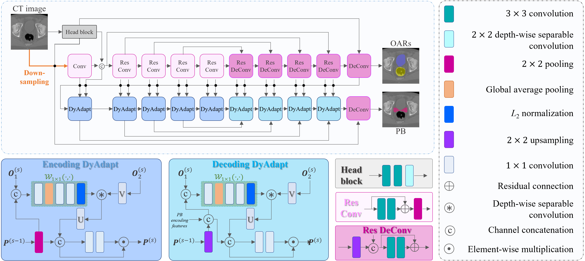

**DyAdapt: Dynamic Cross-Task Representation Adaptation for Clinical Targets Co-Segmentation in CT Image-Guided Post-Prostatectomy Radiotherapy**
==============================================================================================================================

Created by [Chunfeng Lian](https://github.com/chunfenglian/) et al.

Prequisites
------------
python 3.7.6  
pytorch 1.6.0  
numpy 1.18.1  
xxx

Introduction
------------

This work is the pytorch implementation of **DyAdapt**, which xxx

In this repository, there are txxx

License
--------

The DyAdapt code is released under MIT License (see LICENSE file for details).

Citation
--------

If you find our work useful in your research, please cite:

* xxxxx

